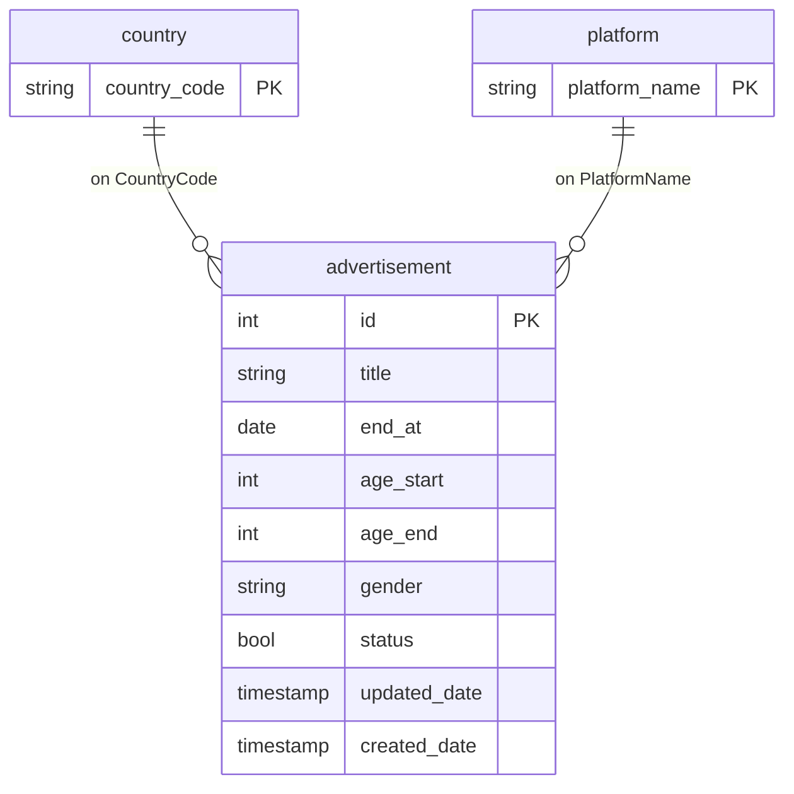

# AdDeliveryLink

## 問題陳述

這是一個練習的專案

設計並實現一個簡化的廣告投放服務，這個服務將提供兩個主要功能：

1. 用於廣告商上架廣告
    - 可以設定投放目標的屬性(年齡、性別、使用平台、國家)
    - 可以設定廣告的開始時間及結束時間
2. 用於用戶端取得廣告
    - 根據用戶的條件取得相符的廣告

## 功能列表

### 目前已實現

- 按照 SOLID 原則設計整個系統架構
- 使用 Gin gorm 完成主要功能
- 使用 redis 作為 cache
- 設定 Docker 架構以及 Github Action CI 的功能
- 使用 Elastic Stack 實作 log 線上日誌
    - 目前實作方式是先將 log 寫到本地 log file 再使用 LogStack 傳到 ES 整理供 Kibana 使用
    - 還須評估這樣實作是否有風險

### TODO List

#### feature:

- 資料匯入匯出
- 定期過期廣告 (每日 check)
- 定期清除過期廣告 (每個季度或半年清理資料庫)

#### docs:

- 流程圖等圖示

## 使用方式

### **_POST /ad_** - 上架廣告

#### **Request Body**

上架廣告時，需要提供以下參數：

| 參數           | 類型            | 必填       | 說明                                                |
|--------------|---------------|----------|---------------------------------------------------|
| conditions   | Object        | Optional | 條件對象，包括 `gender`、`age`、`platform` 和 `country`。    |
| ├── gender   | String        | Optional | 性別篩選，可選值為 `F`（女性）、`M`（男性）、`B`（全部），預設值為 `B`。       |
| ├── ageStart | Number        | Optional | 起始年齡，預設值為 `1`。                                    |
| ├── ageEnd   | Number        | Optional | 結束年齡，預設值為 `100`。                                  |
| ├── platform | Array[String] | Required | 平台篩選，枚舉值為 `ios`、`android`、`web`。                  |
| ├── country  | Array[String] | Required | 國家篩選，枚舉值為 `JP`、`TW`、`CA`、`US`。                    |
| endAt        | String        | Required | 廣告的過期時間，ISO 8601 格式（例如：`2021-01-01T00:00:00Z`）。   |
| startAt      | String        | Required | 廣告的開始投放時間，ISO 8601 格式（例如：`2021-01-01T00:00:00Z`）。 |
| title        | String        | Required | 廣告名稱。                                             |

#### **Request Example**

```json
{
  "conditions": {
    "ageEnd": 100,
    "ageStart": 1,
    "country": [
      "CA"
    ],
    "gender": "M",
    "platform": [
      "android"
    ]
  },
  "endAt": "2021-01-01T00:00:00Z",
  "startAt": "2021-01-01T00:00:00Z",
  "title": "Sample Advertisement"
}
```

--- 

### **GET /ad** - 取得廣告

#### **Query Parameters**

所有參數均為選填，若無指定條件，將返回所有廣告。

| 參數       | 類型     | 必填       | 說明                             |
|----------|--------|----------|--------------------------------|
| age      | Number | Optional | 指定年齡範圍，例如 `age=25`。            |
| country  | String | Optional | 篩選廣告的國家，例如 `country=CA`。       |
| gender   | String | Optional | 篩選廣告的性別，例如 `gender=M`。         |
| platform | String | Optional | 篩選廣告的平台，例如 `platform=android`。 |
| limit    | Number | Optional | 返回的廣告數量上限。預設為 5                |
| offset   | Number | Optional | 起始的偏移數，用於分頁。預設為 0              |

### **Request Example**

```http
GET /ad?age=25&country=CA&gender=M&limit=10&offset=0&platform=android
```

--- 

## 資料庫設計



- platform 和 country_code 是多對多的使用情境，當初為了擴充性選擇這樣設計。如果真的只有一個屬性可以考慮改為一個 table
  存 ad id 以及 string 在程式上對能儲存的值進行限制，這樣在效能以及難度都會比較簡單。
- 雖然目前還沒有這些功能，但考慮到修改的樂觀鎖或權限管理還是儲存了 updated_date 和 created_date。
- status 是作為廣告過期的指標，第一是為了讓定期腳本進行清除，第二是為了搜尋時方片過濾過期的廣告。
- 設計一個複合索引 (gender,status,age_start,age_end,start_at,end_at)。根據 leftmost prefix rule 設計的複合索引，越左邊的
  column 需要越常出現且越複雜，且順序為查詢<-排序<-範圍。

## 技術選擇

### Tech Stack

- [Go](https://go.dev)
- [MySQL](https://www.mysql.com/)
- [Redis](https://redis.io)
- [ELK](https://www.elastic.co/elastic-stack)

### Library

- [go-redis](https://github.com/redis/go-redis)
- [Gin](https://github.com/gin-gonic/gin)
- [Gorm](https://gorm.io/)
- [go-gorm/cache](https://github.com/go-gorm/caches)
- [Validator](https://github.com/go-playground/validator)
- [gin-swagger](https://github.com/swaggo/gin-swagger)
- [logrus](https://github.com/sirupsen/logrus)

### 使用原因

- gin-swagger: API 文檔自動生成
- Validator：是用來驗證輸入的 Library。在 struct 中設定限制就能檢驗錯誤
- logrus: 簡單且結構化 log 工具
- go-redis：redis 的客戶端
- go-gorm/cache：Gorm 的 Plugin，使 Gorm 實作 memory cache。能使用 redis 作為載體。

## 流量測試

### 測試環境

<div align=center>
	<h3>硬體配置</h3>
	
	<h3>Linux 環境</h3>
	
</div>

### 測試結果

- 以下測試結果為使用 Jmeter 進行測試
- 測試方式為 10 分鐘的負載測試
- [Jmeter 的詳細測試報告](https://madfater.github.io/AdDeliveryLink/)

<div align=center>
	<h3>測資</h3>
	
	<p>除了 limit 和 offset 皆為隨機</p>
	<h3>結果圖表</h3>
	
	<p>Transaction Per Second</p>
	
	<p>Response Times Over Time</p>
</div>

## 運行專案

### 方法 1 : clone 專案

1. 確保你已經在本地環境中安裝了 Docker 和 Docker Compose
2. 確保你已經 clone 了專案並在終端中切換到專案目錄
3. 執行以下命令來啟動容器：

```bash
docker compose up --build
```

4. /swagger/index.html 觀看 API 文檔，確保正確啟動

### 方法 2 : 使用 docker image

1. 確保你已經在本地環境中安裝了 Docker 和 Docker Compose
2. 確保你已經複製下方的 Docker Compose 到本地
3. 執行以下命令來啟動容器：

```bash
docker compose up
```
4. /swagger/index.html 觀看 API 文檔，確保正確啟動

```yml
version: '3.9'
services:
  app:
    image: ghcr.io/madfater/app:main
    environment:
      GIN_MODE: release
      MYSQL_USERNAME: root
      MYSQL_IP: db
      MYSQL_PORT: 3306
      MYSQL_DATABASE: AdDeliveryLink
      REDIS_IP: redis
      LOGSTASH_URL: http://logstash:5000
    ports:
      - "8080:8080"
    depends_on:
      - db
      - redis
      - logstash
    restart: always
    volumes:
      - logs:/root/logs

  db:
    image: ghcr.io/madfater/db:main
    environment:
      MYSQL_DATABASE: AdDeliveryLink
      MYSQL_ALLOW_EMPTY_PASSWORD: "true"
    ports:
      - "3306:3306"
    volumes:
      - db-db:/var/lib/mysql
      - db-conf:/etc/mysql/conf.d
      - db-logs:/logs

  redis:
    image: redis:alpine
    volumes:
      - redis-data:/data
    ports:
      - "6379:6379"

  elasticsearch:
    image: docker.elastic.co/elasticsearch/elasticsearch:8.10.1
    container_name: elasticsearch
    environment:
      - discovery.type=single-node
      - xpack.security.enabled=false
    volumes:
      - elasticsearch-data:/usr/share/elasticsearch/data
    ports:
      - "9200:9200"

  logstash:
    image: docker.elastic.co/logstash/logstash:8.10.1
    user: "0:0"
    container_name: logstash
    depends_on:
      - elasticsearch
    volumes:
      - ./logstash.conf:/usr/share/logstash/pipeline/logstash.conf
      - logs:/logs
    ports:
      - "9600:9600"

  kibana:
    image: docker.elastic.co/kibana/kibana:8.10.1
    container_name: kibana
    environment:
      - ELASTICSEARCH_HOSTS=http://elasticsearch:9200
    ports:
      - "5601:5601"

volumes:
  redis-data:
  db-db:
  db-conf:
  db-logs:
  elasticsearch-data:
  logs:
