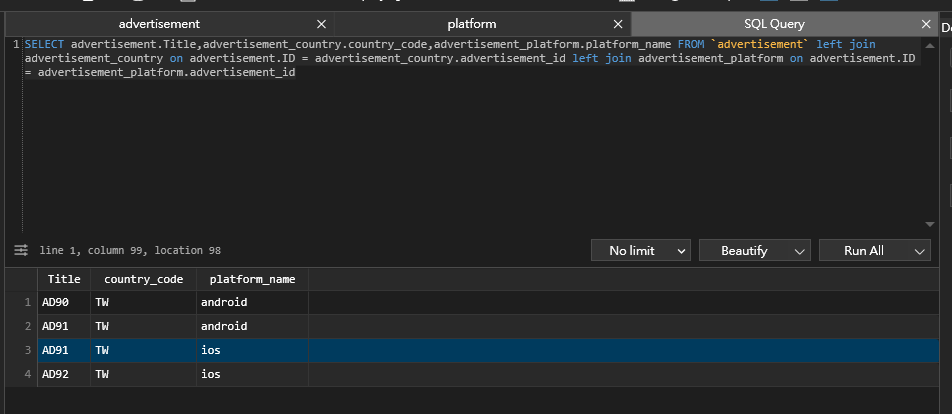
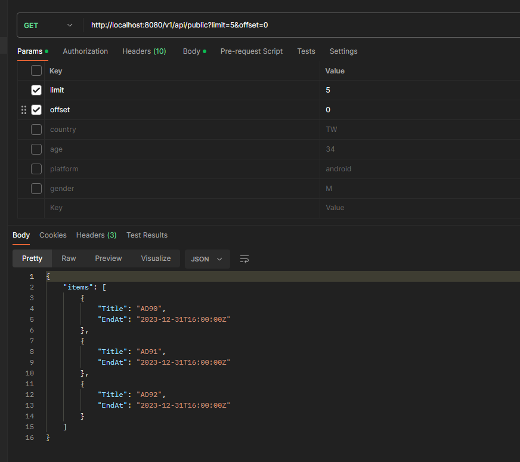
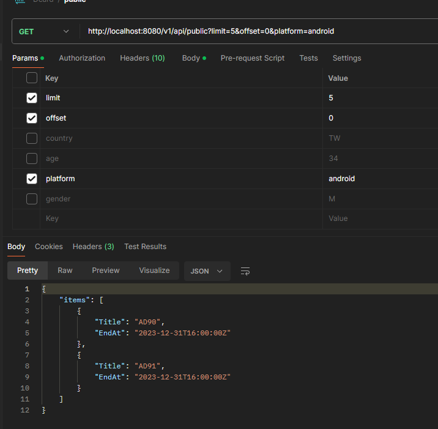
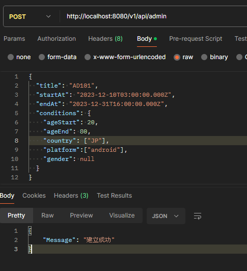
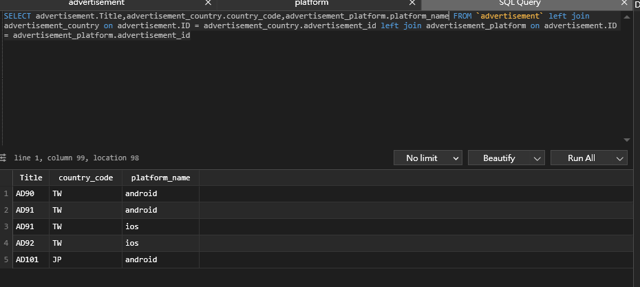

# Dcard Backend Assignment

## Tech Stack
- [Go](https://golang.org/)
- [MySQL](https://www.mysql.com/)
- [Gin](https://github.com/gin-gonic/gin)
- [Gorm](https://gorm.io/)
- [Validator](https://github.com/go-playground/validator)

## 想法和設計上的選擇

### 問題陳述

設計並實現一個簡化的廣告投放服務，這個服務將提供兩個主要的API：

admin API：用於創建廣告並設定廣告的條件。

public API：用於根據特定條件列出符合條件的廣告。

### 目標

建立一個簡單易用的 API 系統，能夠有效地生成和提供廣告。
提供一個快速、準確的廣告匹配系統，確保用戶能夠收到與其需求相匹配的廣告。

### 解決方案概述

- admin API: 將根據用戶提供的信息，生成廣告並將其存儲到資料庫中。
  - Conditions沒輸入的皆以NULL儲存並表示為皆可
- public API: 將接收用戶的查詢，根據查詢條件從資料庫中檢索符合條件的廣告並返回給用戶。
	- 除了offset以及limit皆為optional

### 技術選擇

1. 對於資料庫，我使用 MySQL 來存儲廣告，因為它是一個穩定且廣泛使用的關係型資料庫。
2. 對於 API 框架，我使用 Gin，它是一個輕量級但功能豐富的 Web 框架，適合構建高性能的 API。
3. 我使用 Gorm 作為 ORM 庫，其優化良好、可與各大熱門資料庫交互。
4. 為了方便驗證用戶輸入，我們將使用 validator 庫。

### 性能優化

1. 使用了GORM，這個ORM 庫會在與資料庫連線時，將連線自動加入Routine Pool進行多線程的處理。
2. 將GORM的Cache Statment開啟，這樣可以減少與資料庫的連線。
3. 設定GORM的Session數量及上限，讓其可以開啟多個Session進行連線且不會因為開啟過多Session將網路阻塞。
4. 將GORM將SkipDefaultTransaction開啟，跳過確認資料一致性的預設步驟以提升效能。

### 成果


上圖為資料庫的資料<br>
1. 使用public API搜尋所有廣告<br>

2. 使用public API搜尋特定平台的廣告<br>

3. 使用admin API創建廣告<br>



## 運行專案

1. 確保你已經在本地環境中安裝了 Docker 和 Docker Compose。
2. 在終端中切換到你的專案目錄。
3. 執行以下命令來啟動容器：

```bash
docker-compose up
```

## 單元測試
這個專案包含了單元測試，你可以在controlers目錄下找到它們。你可以使用以下命令運行單元測試：
```bash
go test ./controlers
```
本專案也有使用Github Action進行CI