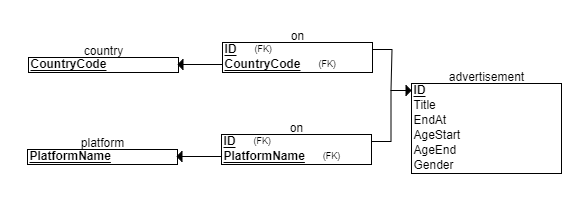
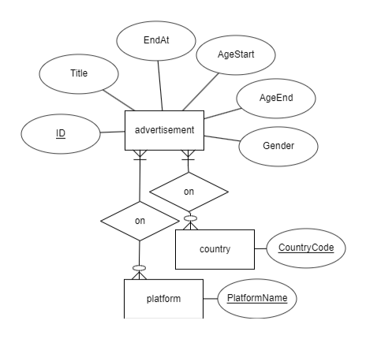

# Simple-Advertisement API

## 問題陳述

設計並實現一個簡化的廣告投放服務，這個服務將提供兩個主要的API：

admin API：用於創建廣告並設定廣告的條件。

public API：用於根據特定條件列出符合條件的廣告。

## 解決方案概述

- 創建一個資料庫
	- 將condition中的可複數資料的資料使用多對多的模式進行儲存
	- 其他皆為一般的attribute儲存在同一個資料表

- admin API：將根據用戶提供的資料，生成廣告並將其存儲到資料庫中
	- 假設用戶並未輸入，使用預設值進行儲存
	- Gender：以F及M分別代表女性及男性。預設值將為NULL以代表皆可
	- Age：有區間故使用AgeStart、AgeEnd區分上下限。預設值分別為1以及100
	- Platform、Country：使用多對多的模式進行儲存。預設將不會儲存於聯合資料表中

- public API：將接收用戶的查詢，根據查詢條件從資料庫中檢索符合條件的廣告並返回給用戶
	- 除了offset以及limit皆為optional
	- 廣告為一個小時刷新過期時間，以免造成Memory Cache快速過期

## 資料庫設計

<div align=center>
	
	
</div> 
 
-	對ID、AgeEnd、AgeStart、Gender設置index提高搜尋速度

## 技術選擇

### Tech Stack
- [Go](https://go.dev)
- [MySQL](https://www.mysql.com/)
- [Redis](https://redis.io)

### Library
- [go-redis](https://github.com/redis/go-redis)
- [Gin](https://github.com/gin-gonic/gin)
- [Gorm](https://gorm.io/)
- [go-gorm/cache](https://github.com/go-gorm/caches)
- [Validator](https://github.com/go-playground/validator)

### 使用原因

- Validator：它是用來驗證輸入的Library。僅需要在struct中設定好限制就能方便的驗出錯誤。
- go-redis：redis的客戶端。
- go-gorm/cache：Gorm的Plugin，只需實作Get、Store及Invalidate，就能讓Gorm自行處裡Memory cache的邏輯。能使用上者實作，讓其變成使用redis作為快取伺服器。

## 流量測試

### 測試環境

<div align=center>
	<h3>硬體配置</h3>
	
	<h3>Linux環境</h3>
	
</div> 

### 測試結果

- 以下測試結果為使用Jmeter進行測試
- 測試方式為10分鐘的負載測試
- [Jmeter的詳細測試報告](./jmeter/index.html)

<div align=center>
	<h3>測資</h3>
	
	<p>除了limit和offset皆為隨機</p>
	<h3>結果圖表</h3>
	
	<p>Transaction Per Second</p>
	
	<p>Response Times Over Time</p>
</div> 

## 運行專案

1. 確保你已經在本地環境中安裝了 Docker 和 Docker Compose。
2. 在終端中切換到你的專案目錄。
3. 執行以下命令來啟動容器：

```bash
docker compose up --build
```
